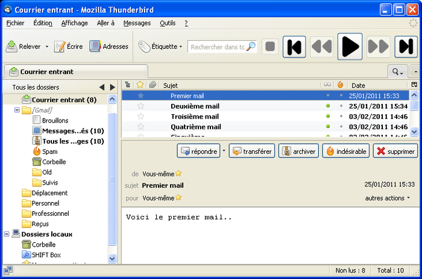

# Shift-Box
<i>Replay your INBOX!</i>

This work has been presented at the CEAS'10 (<a href="paper/shift-box-ceas10.pdf">pdf</a>) conference and has been released as a Mozilla Thunderbird add-on (<a href="https://addons.mozilla.org/en-Us/thunderbird/addon/shift-box/">download extension</a>). Overall, more than 3.4K users downloaded it, and hundreds use it every day.

To cite the project:

> Romain Vuillemot, Jean-Marc Petit, Mohand-Saîd Hacid. "Shift-BOX: INBOX Time Shifting to Reduce Email Clutter". CEAS’10 – Collaboration, Electronic messaging, Anti-Abuse and Spam Conference. July 2010. Shift-Box website. (<a href="paper/shift-box-ceas10.pdf">pdf</a>) 

<object width="560" height="344">
<param name="movie" value="http://www.youtube.com/v/pTfMaMjkDJc?version=3&amp;theme=dark&amp;fs=0&amp;cc_load_policy=1&amp;iv_load_policy=1&amp;modestbranding=0"></param>
<param name="allowScriptAccess" value="always"></param>
<embed src="http://www.youtube.com/v/pTfMaMjkDJc?version=3&amp;theme=dark&amp;fs=0&amp;cc_load_policy=1&amp;iv_load_policy=1&amp;modestbranding=0" type="application/x-shockwave-flash" allowScriptAccess="always" width="560" height="344"></embed>
</object>